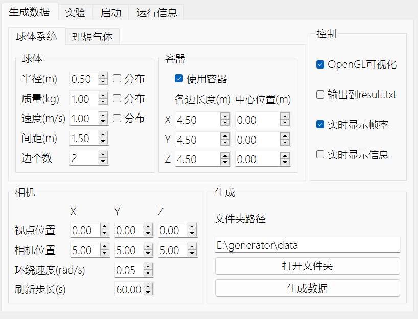
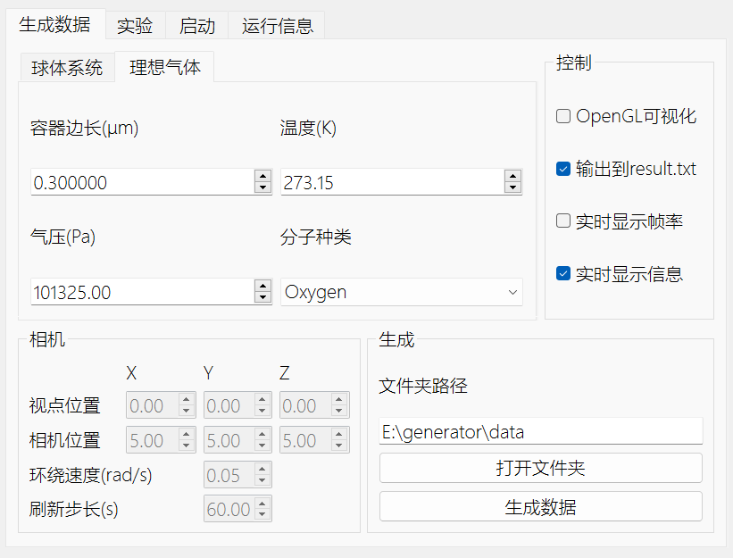
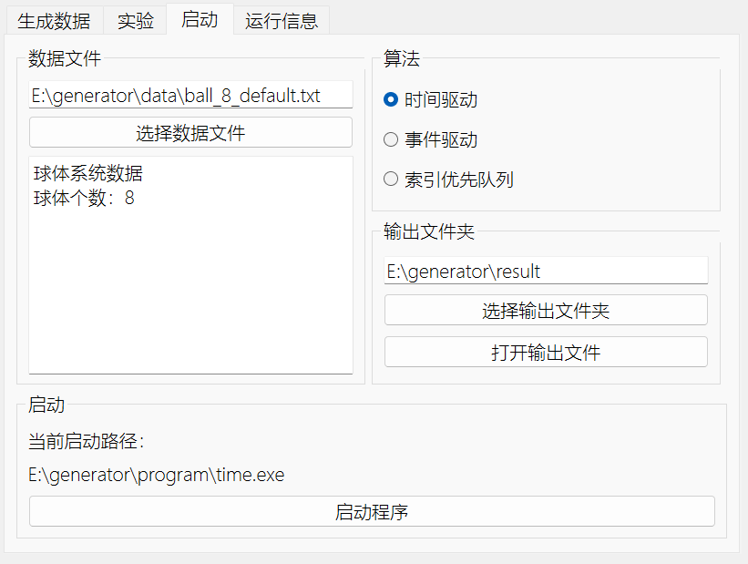
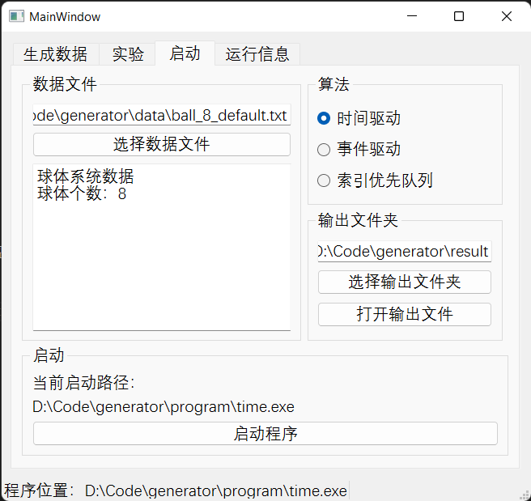
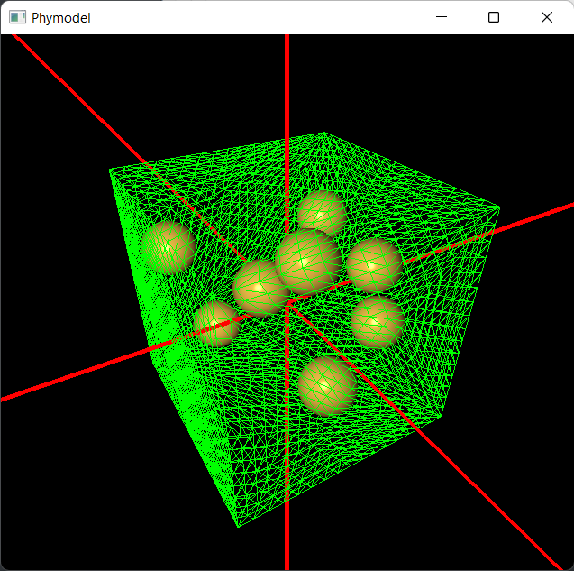
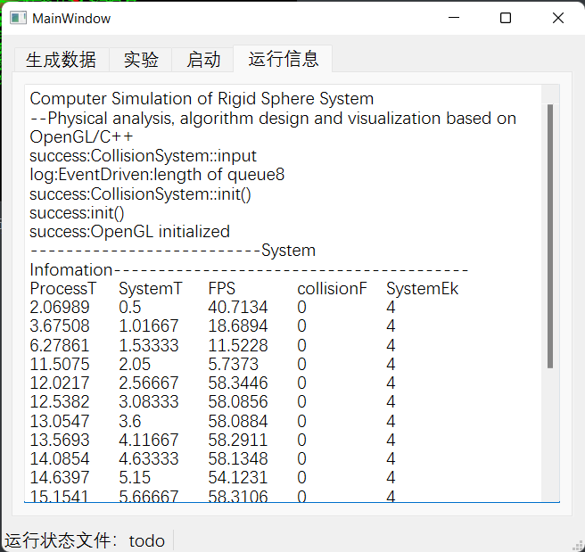

# 用户手册和技术文档

## 一、界面简介和使用方法

数据生成和启动器使用Qt6.6编写。程序用选项卡分为4个部分：生成数据、实验、启动和运行信息。

* 生成
  * 该选项卡可以设置生成数据的类型，配置各种参数。生成数据的类型分为球体系统和理想气体两大类，可以通过选择类型选项卡来切换。切换选项卡时GUI会发生相应变化，指示哪些参数可以配置。
  * 理想气体：不支持可视化，不允许配置有关选项
  * 分布：如果勾选分布，球体的半径和质量服从从0到输入值的均匀分布。速度向量的各分量服从以0为平均值，输入值为标准差的正态分布。否则会生成以输入值为模长，方向随机的速度向量。 
  * 生成文件夹路径：生成数据将会保存在选择的文件夹中。文件自动命名，名称包含数据类型、实体个数、生成时间等信息。
  
  
* 实验
    * 选择并启动实验
* 启动
  * 该选项卡的建议操作顺序：选择数据文件->选择算法->选择输出文件夹->核对程序启动路径->启动程序
  * 数据文件：选择后会通过文件名自动识别该文件的信息，从而决定可选择的调用程序。因此，不符合命名规范的文件将会显示识别错误，不允许启动。
  * 输出文件夹：用于存放输出文件。输出文件自动命名，包含算法、数据文件、运行时间等信息 
  
* 运行信息
  * 程序运行完成后会跳转到该选项卡，文本框会显示程序的输出文件

使用例：

* 双击启动`generator.exe`，启动后界面默认位于选项卡`启动`，并配置好了默认路径
* 点击`启动程序`按键启动模拟程序，弹出OpenGL窗口
* 关闭OpenGL窗口，启动器跳转至`运行信息`选项卡，可以查看程序运行信息

## 二、技术文档

### 2.1 数据文件设计

数据文档分区设计如下：

* Line1:控制变量，0表示关闭，1表示开启
    * OpenGL可视化
    * 关闭窗口时输出数据到result.txt
    * 显示帧率
    * 显示系统信息
* Line2:相机数据
    * CameraLoc:相机位置
    * LookAt:视点位置
    * rot_v:环绕旋转角速度
    * dispRate:指定系统运动速度，系统运动时间为1/dispRate
* Line3-EOF:CollisionSystem系统信息
    * 读取至该部分时ifstrm文件输入流控制权转交至`CollisionSystem::init()`函数
    * 第一行用一个大写字母表示其类型，一个数字表示该物体的数量n
    * 重复执行n次该物体的输入函数，读取n个物体
    * 检测文件尾

数据文档中，统一使用`\t`制表符分隔数字、字母，便于excel识别。浮点数统一设置`std::setprecision(8) << std::fixed;`

输出文件不包括Line1-2。示例输入文件如下

```txt
1   1   1   1
5  5  5  0   0   0   0.05 60.0
C   1
0	0	0   4.5	4.5	4.5
B   8
-0.75	-0.75	-0.75	1.88076	2.03076	0.731008	1	0.5
-0.75	-0.75	0.75	0.280817	-2.02327	-0.129921	1	0.5
-0.75	0.75	-0.75	-0.413147	-0.65409	0.724323	1	0.5
-0.75	0.75	0.75	0.263846	0.997354	0.788994	1	0.5
0.75	-0.75	-0.75	2.44584	1.01916	-0.7603	1	0.5
0.75	-0.75	0.75	-0.16675	-1.75322	0.298298	1	0.5
0.75	0.75	-0.75	2.06121	0.261415	1.07991	1	0.5
0.75	0.75	0.75	0.444628	0.923812	0.181061	1	0.5
```

输出文档包括两大部分，第一部分为程序实时状态，第二部分为程序运行结果

```txt
第一部分：实时状态
Computer Simulation of Rigid Sphere System
--Physical analysis, algorithm design and visualization based on OpenGL/C++
success:CollisionSystem::input
log:EventDriven:length of queue8
success:CollisionSystem::init()
success:init()
success:OpenGL initialized
第二部分：运行结果

```


### 2.2 数据生成与启动器设计

#### 组件功能设计以及实现步骤

* 为简化程序流程，在组件中输入并不会立即改变程序内相关变量的值，仅按下按钮时从组件中读取对应值

##### 球体的生成

按下生成按钮后，程序执行如下步骤：

* 获得生成文件夹路径`genDir`
* 获得当前选项卡信息（球体or气体），获取生成参数
* 根据生成参数生成数据文件名称`genFileName`
  * 文件名称约定：`type_num_time.txt`
    * type: ball, gas
    * num: 系统球体个数
    * time：hour+minute+second
* 生成数据
* 生成完成，关闭文件，弹窗通知

球体速度的生成：
* 不勾选分布：使用GLM库生成定长为$v$的随机向量
* 勾选分布：把所填速度$v$视为标准差，每个速度分量服从正态分布$N(0, v)$

质量和半径：若勾选随机，将输入值视为最大值$max$，则服从均匀分布$U(0, max)$

##### 气体的生成

给定$p,V,T$，生成气体分子数据：

1. 通过理想气体状态方程确定容器内气体分子数$$N=\frac{pVN_A}{RT}$$其中$R=8.314462618 J mol^{-1} K^{-1}$是普适气体常量
2. 通过理想气体状态方程求得气体分子平均距离$$d=\sqrt[3]{\frac{RT}{pN_A}}$$
3. 求得每边分子数$$n=\left\lfloor \frac{\sqrt[3]{V}}{d}\right\rfloor$$
> 注意：最终生成分子数为$n^3$, 因此此处的向下取整可能导致分子数量大幅缩水。为此，采用这样的调适方法： 
> 若$n^3<N$（几乎都会这样：生成的分子数小于实际分子数。实测当容器边长为0.3时少了约2000个分子）：分别尝试对各边分子数加1，重新协调该方向的距离$gDis$， 直到$n_X n_Y n_Z > N $为止。在生成循环中添加测试条件，当生成个数到达$N$时停止。以此保证生成气体分子数保持准确。
3. 确定分子速度分量分布函数的方差$$\sigma^2=\frac{k_B T}{m}$$，具体数据生成方法同球体系统。
> 注意，STL正态分布随机数引擎第二个参数是标准差$\sigma$，与我教材中$N(\mu,\sigma^2)$使用的方差不同
>
> 数据来源:https://physics.nist.gov/cgi-bin/cuu/Value
>
> 

### 2.3 程序工作目录结构

为保证程序正确运行，程序目录结构应该如下

*  \currentPath:工作目录
   *  \program:存放模拟程序，这些模拟程序可以通过命令行调用
      *  time.exe
      *  event.exe
      *  index.exe
      *  gas.exe

   *  \data：存放预置的和生成的输入数据文件
     *  \exp1
     *  ball_8_default.txt
     *  gas_725430_223329.txt

   *  \result：存放模拟程序运行后生成的输出文件
      *  exp1.txt
      *  exp2.txt
      *  exp3.txt
      *  result_gas_725430_223329.txt
      *  ...

   *  \generator.exe

## 三、应用程序接口
