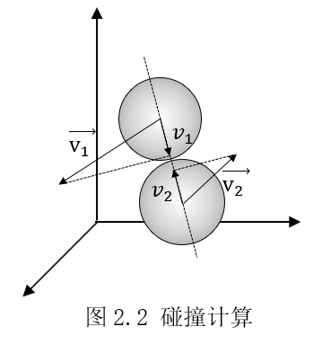

# 刚性球体系统的物理分析、算法设计和OpenGL可视化

小组成员：朱宝林、尤比佳、林佳诚、张宏彬

指导老师：黄罗华

摘要：

关键词：

## Note:编辑前请先阅读talk.md

## 第1章 绪论

### 1.1 研究背景

经过几个世纪的发展，数学、物理等基础学科理论已日益完善。随着研究内容越来越深入，其高度抽象的公式无法直观理解，复杂的计算难以靠人力来完成。现代科学研究常以数学、物理等基础学科作为理论基础，而将计算机作为计算和可视化工具。此次研究性学习，我们选取物理学的经典模型——小球碰撞为研究对象，进行物理理论分析，并尝试在计算机上模拟实现以此模型为基础的一些应用场景。

小球碰撞模型在物理研究中具有重要意义。物理学的一个重要方法是理想化模型。当物体自身形状可以忽略时，常常将其简化为小球或质点进行处理。借助小球碰撞模型，物理学家对理想气体的微观运动进行了深入探索。小球碰撞模型还在化学反应动态过程、元素相变、最密堆积问题、天体物理等领域具有广泛应用。

在现代科学研究中，计算机已经成为不可或缺的一环。计算机凭借其强大的性能和高效的算法，能够快速处理海量数据并得到准确的结果。利用可视化技术，研究人员得以实时观察数据情况，获得直观感受

### 1.2 研究目的与意义

通过此次研究，我们希望深入探索小球碰撞这一经典模型，学习物理研究的基本方法；探索在计算机上模拟物理过程，学习使用算法处理大量数据；学习使用图形库将研究结果可视化；学习运用科学研究方法探索、分析并解决问题，实际体验科学研究过程。这将极大地培养我们的和科学研究能力，为我们将来从事科学研究工作打下坚实基础。

### 1.3 研究内容

物理：刚性小球碰撞模型：物体模型、状态模型、过程模型

算法：碰撞检测、事件处理（排序）、驱动模拟

可视化：OpenGL库的使用

### 1.4 研究方法

实验法、文献研究法、模型方法、信息研究方法

## 第2章 物理模型

本章简要介绍本研究性学习所使用的物理模型基础：首先对由刚性小球和固定平面构成的碰撞系统进行建模，然后分析系统元素间的相互作用，最后将该刚体模型应用到理想气体等具体问题上。

### 2.1 刚性球体系统建模

我们需要建立模型可以分为：实体物理模型、状态物理模型和过程物理模型。


* 实体及其状态的物理模型：
  * 小球：质量$m$，半径$r$，位置$\vec{p}$，速度$\vec{v}$
  * 平面：位置（平面上一点）$\vec{p}$，法向量$\vec{n}$
  * 长方体容器：容器由三对分别与$x,y,z$坐标平面平行的平面构成，它们的位置$t_{max/min}, t=x,y,z$。

系统中只有小球运动，小球与其它物体的相互作用（碰撞）可以分成三类问题：碰撞预测、检测和处理。所有碰撞均为弹性碰撞，不考虑摩擦和自旋。

过程分析的方法将决定编程模型：时间驱动模型依赖于碰撞检测，事件驱动模型依赖于碰撞预测。各类物体的碰撞检测都已有非常详尽的研究，可以直接采用。本论文主要使用事件驱动模型，因此使用碰撞预测分析。

### 2.2 碰撞预测

#### 球-球

球体占有到球心一定距离内的空间，可以利用空间中两点距离公式确定两球是否发生相撞。

设空间中两球位置分别为 $\vec{p_1}=\left(x_1,y_1,z_1\right)$ 和 $\vec{p_2}=\left(x_2,y_2,z_2\right)$ ，两球速度为 $\vec{v_1}=\left(v_{1x},v_{1y},v_{1z}\right)$ 和 $\vec{v_2}=\left(v_{2x},v_{2y},v_{2z}\right)$ ，两球半径分别为$r_1,r_2$。

设两球在$t$时刻相撞，则有：

$$\left|\left(\vec{p_1}+t\vec{v_1}\right)-\left(\vec{p_2}+t\vec{v_2}\right)\right|=r_1+r_2$$

令 $\Delta\vec{v}=\vec{v_1}-\vec{v_2},\Delta\vec{p}=\vec{p_1}-\vec{p_2}$ 可得一元二次方程：

$$\left|\Delta\vec{v}\right|^2+2\cdot\Delta\vec{v}\cdot\Delta\vec{p}\cdot t+\left|\Delta\vec{p}\right|^2–(r_1+r_2)^2=0$$

$$\Delta=2\sqrt{\left(\Delta\vec{v}\cdot\Delta\vec{p}\right)^2-\left|\Delta\vec{v}\right|^2\left[\left|\Delta\vec{p}\right|^2-\left(r_1+r_2\right)^2\right]}$$

计算方程判别式，若判别式 $\Delta\geq0$ 得到方程两根：

$$t_1=\frac{-2\Delta\vec{v}\cdot\Delta\vec{p}+\sqrt\Delta}{2\left|\Delta\vec{v}\right|^2}$$

$$t_2=\frac{-2\Delta\vec{v}\cdot\Delta\vec{p}-\sqrt\Delta}{2\left|\Delta\vec{v}\right|^2}$$

对方程根的情况分类讨论，可知：

* 若方程两根均小于0，则两球不会发生碰撞。
* 若方程两根不全小于0，则两球发生碰撞的时间是最小的非负实根

在实现中，还可以在计算前加上检验措施来提高准确度和效率。

* 重叠检测：
$$\left|\Delta\vec{r}\right|<r_1+r_2$$
若该式为真，则小球重叠。

* 相离运动检测：
$$\left(\Delta\vec{r}\cdot\vec{v_2}<0\right)\land\left(\Delta\vec{r}\cdot\vec{v_1}>0\right)$$

若该式为真，则小球相离，不可能发生碰撞，可跳过求解碰撞事件的过程。

#### 球-平面

设平面位置$\vec{p_0}$，法向量$\vec{n}$；小球半径$r$，位置$\vec{p}$，速度$\vec{v}$。使用速度和相对位置在平面法向量方向上的分量即可计算得到小球和平面碰撞的时间：

$$v=\vec{v}\cdot\vec{n}$$

$$d=(\vec{p}-\vec{p_0})\cdot\vec{n}$$

$$t=-\frac{d}{v}$$

### 2.3 碰撞处理

#### 球-球

任何维度的小球碰撞均可转化为沿球心连线方向的一维碰撞，在其他方向上运动状态不变。这是因为小球碰撞时，弹力的方向垂直于小球接触点的切面，从接触点指向球心。



假设t时刻两小球发生碰撞，取该时刻小球位置矢量相减并归一化得到球心连线的方向向量

$$\widehat{\vec{p_1}-\vec{p_2}}=\vec{p}$$

将两小球的速度与方向矢量点乘得到速度在球心连线方向的分量

$$\vec{v_{10}}\cdot\vec{p}=v_{10}$$

$$\vec{v_{20}}\cdot\vec{p}=v_{20}$$

在球心连线方向上（一维空间）处理小球碰撞，应用《力学》`<ref>`中联立动量、动能守恒方程得到的一维碰撞解

$$v_1=\frac{\left(m_1-m_2\right)v_{10}+2m_2v_{20}}{m_1+m_2}$$

$$v_2=\frac{\left(m_2-m_1\right)v_{20}+2m_1v_{10}}{m_1+m_2}$$

计算该方向上速度变化量，将变化量乘以方向向量转换到三维空间，再与原速度相加

$$\vec{v_1}=\vec{v_{10}}+\left(v_1-v_{10}\right)\cdot\vec{p}$$

$$\vec{v_2}=\vec{v_{20}}+\left(v_2-v_{20}\right)\cdot\vec{p}$$

从而完成了一次小球碰撞的处理

#### 球-平面

刚性球体与平面碰撞前后，垂直于平面方向速度反向，平行于平面方向运动状态不变。

$$\vec{v}=\vec{v_0}-2(\vec{v}\cdot\vec{n})\vec{n}$$

### 2.4 具体物理模型

#### 2.4.1 理想气体

通常状况下，气体分子间间距较大，分子间作用力可以忽略，气体分子可以简化为质点或刚性球体。这就是理想气体模型。由于气体粒子十分微小，对理想气体性质的研究一般采用统计方法。现在我们可以借助计算机强大的计算能力，在围观层面模拟一定量的理想气体运动状况，来验证统计方法得到的物理定律的正确性。

碰撞程序接受每一个刚性球体的位置、速度、质量、半径等具体信息。

#### 2.2.2 布朗运动

花粉粒子在水中的无规则运动。液体不方便建模，改为熟悉的气体分子：PM2.5

细颗粒物指环境空气中空气动力学当量直径小于等于 2.5 微米的颗粒物

* 颗粒物直径：2.5e-6m=2.5um
* 空气分子直径：0.3-.04nm

#### 2.2.3 行星环

1859年，麦克斯韦发表论文《论土星环运动的稳定性》（On the stability of the motion of Saturn's rings），证明土星环是由大量独立的小颗粒构成的。历史上对于行星环的研究主要有两种方法：一种把行星环当做N体系统，一种使用流体力学方法。如今，“流线表示法”等新的理论研究方法不断被提出，同时数值模拟也飞速发展。尽管刚体粒子模型已经被证明为是行星环不太恰当的近似，但它仍是重要的研究方法，引文《行星环动力学》就是基于该模型展开分析。


## 第3章 程序设计

在这一章，我们主要使用UML(Unified Modeling Language，统一建模语言)来描述我们的程序设计过程。我们采取自顶向下的思路来设计程序，再用自底向上方法开发程序，从系统内元素开始，一步步向上实现整个系统。

### 3.1 面向对象分析和设计

为了使用计算机实现对上述物理过程的模拟，并将其运用到更多场景中，我们这些物理模型抽象为程序中的对象，物理过程抽象为这些对象的操作。

* 碰撞系统对象：
  * 属性：记录系统中所有物体的状态
  * 操作：输入数据、更新系统状态、显示系统状态

图3-1给出了碰撞系统的用户视图。

> 图片3.1 用户视图

按第二章物理分析的思路，我们在碰撞系统内创建实体类和事件类。实体类保存实体信息并提供实体相关操作；事件类保存事件的信息，并提供对事件的处理（在实现中，处理会转交给具体的实体）。图3-2给出了该碰撞系统的类图，列出了它们的属性和方法。虚线表示公共接口API。

要点：一次碰撞事件中必定有一个小球参与。因此，碰撞处理的操作应当全部交给在运动实体类（即实现运动实体与其它元素的碰撞处理）。这样做可以提高实现效率，也进一步加强了类之间的封装性。

> 图片3.2 碰撞系统中的类图

### 3.2 基础类型API

<todo>:再分方面，整理内容

在实现数据类型前应当设计好API。下文展示了CollisionSystem类和Ball类的API

> 表格3.1 CollisionSystem类型的API

|返回类型|函数名和参数列表|说明|
|-|-|-|
||CollisionSystem(istream &is)|从给定输入流创建一个碰撞系统|
|void|run(float t)|让系统运行指定时长|
|void|reverse()|使系统反向运动|
|istream &|operator>>(istream &is, CollisionSystem &system)|（友元）从输入流中读取数据|
|ostream &|operator<<(std::ostream &, CollisionSystem &)|（友元）向输出流输出系统状态|
||||

> 表格3.2 Event类型的API

|返回类型|函数名和参数列表|说明|
|-|-|-|
||Event(shared_ptr\<Ball>, shared_ptr\<Object>, const float)|根据给定数据创建事件|
|float|t()|返回该事件发生的时刻|
|void|handle()|处理事件|
|bool|operator<(const Event &)|比较两个事件发生的先后|
|ostream &|operator<<(ostream &, const Event &)|（友元）输出事件信息|
|ostream &|operator<<(ostream &, priority_queue<Event, vector\<Event>>)|（友元）输出事件队列|

> 表格3.3 Ball类型的API

|返回类型|函数名和参数列表|说明|
|-|-|-|
||Ball(istream &)|从输入流中创建一个Ball并递增该类的计数器|
|glm::vec3 |loc()|位置|
|glm::vec3 |vel()|速度|
|float |r()|半径|
|float |m()|质量|
|unsigned int |cnt()|碰撞次数|
|Object_type |type()|物体类型|
|unsigned int|num()|编号|
|float|predict(Object &)|预测碰撞|
|void|bounce(Object &)|处理碰撞|
|bool |examine(Object &)|检测重叠|
|istream &|operator>>(std::istream &, Ball &)||
|ostream &|operator<<(std::ostream &, const Ball &)||
|ostream &|operator<<(std::ostream &, const std::vector<std::shared_ptr\<Ball>> &)||

为了简化运算，我们在Ball类中使用了GLM数学库中的向量vec3类表示小球在世界空间中的位置和速度。

在实现碰撞操作接口时，我们碰到了类继承的问题。在Event类型中，我们只储存第二碰撞物体的基类指针（如果为每一种物体都创建指针将影响将来程序的拓展，使Event类与Object类不能相互独立。如果开发了新的Object子类型，那么Event也要作出相应的更改）。在调用Event.handle()函数时，该函数无法确定调用Ball.bounce()的哪个版本。最终，我们为Object类实现了一个统一的type接口，这样可以确切地知道当前对象是Object的哪一个子类，然后使用动态绑定来转换指针。

```C++
void Ball::bounce(Object &object)
{
    count++;
    switch (object.type())
    {
    case Object_type::BALL:
    {
        Ball &ball = dynamic_cast<Ball &>(object);
        this->bounce(ball);
        break;
    }
    case Object_type::WALL:
    {
        Wall &wall = dynamic_cast<Wall &>(object);
        this->bounce(wall);
        break;
    }
    }
}
```

事件有效性有两种处理方法：

1. 处理时判断：在类内创建小球碰撞次数的记录。如果在处理该事件时小球的累计碰撞次数发生了变化，则小球已经发生了碰撞，事件失效。
2. 处理时删去：碰撞后，小球的运动轨迹发生改变，与该小球有关的事件均失效，因此可以在每次碰撞后删去与参与碰撞的物体有关的事件。

方法②可以在一定程度上减少内存使用冗余，但方法①减少了访问数组的次数，具有更高的效率。事实上，STL库中的priority_queue优先队列类型并不支持遍历元素，若选择方法②需要自行实现。

事件时间：ball类中的predict方法返回当前时刻距离碰撞发生的时长，而在优先队列中事件按从t=0的初状态开始的时间从小到大排序。因此在创建事件时应当传递predict+currentTime。

### 3.3 程序运行流程

图3-4详细地展示了碰撞系统程序的运行流程。总共分为4个模块：主循环，更新循环，处理模块，预测模块。后3个模块都由CollisionSystem类管理，对用户隐藏。

## 第4章 算法分析和实现

### 4.1 算法探究1：时间驱动和事件驱动

刚性球体碰撞系统的模拟方法有两种：时间驱动和事件驱动。

时间驱动的步骤是：设置固定长度的更新时间$dt$，每次更新时检测小球的碰撞情况。但这种方法计算量极大。设系统有N个小球，则模拟所需时间与N^2/dt成正比。使用包围盒检测可以减少检测次数，我们将在下一节探究。

事件驱动的步骤是：预测可能的碰撞，放入优先队列。只有系统运动到最近一次事件发生时才需要处理事件和再次预测事件。<todo>:猜想复杂度因素：球体系统密度，球体系统运动剧烈程度。

### 4.2 算法探究2：包围盒检测

> 原命题：尝试将大片区域分割为长方形的小格，并在一种新的事件类型中仅预测某个例子在某一时刻和相邻9个方格中所有粒子的碰撞。改进CollisionSystem的simulate方法，减少了碰撞预测数量，代价是监测粒子在方格之间的运动

<todo>:这里应当使用八叉树划分空间，需要学习算法[空间划分的数据结构(四叉树/八叉树/BVH树/BSP树/k-d树) - 走看看 (zoukankan.com)](http://t.zoukankan.com/KillerAery-p-10878367.html)

### 4.3 算法探究3：优先队列和索引优先队列

> 原命题：使用索引优先队列来保证优先队列的长度最多与例子数量呈线性关系，而非平方级别或者更糟

若系统较为密集，则短时间内可能发生较多碰撞事件。为了防止内存溢出，又要保证效率最大，应当合理设计优先队列的长度。

索引优先队列的思想是：用对象的索引代替对象作为优先队列。这样，我们可以快速访问优先队列中的特定对象，并且可以减少堆上浮下沉操作所使用的时间。

实现：

在CollisionSystem中，定义vector\<Event>用于储存事件对象，定义index_prioriti_queue<>

<odo>:[索引优先队列的工作原理与简易实现 - nullzx - 博客园 (cnblogs.com)](https://www.cnblogs.com/nullzx/p/6624731.html)

## 第5章 OpenGL可视化

### 5.1 模型绘制

本节介绍在OpenGL中绘制网格平面和球体的一些细节。

#### 5.1.1 绘制思路

OpenGL是一个用于渲染图形的跨平台的应用程序接口，在计算机图形学领域十分流行。在C++程序中调用OpenGL API即可绘制图形。

如果系统中物体数量增多，那么采用传统方法为每一个物体建立模型、计算顶点、向OpenGL传输数据进行渲染就会耗费大量时间。事实上，可以只用一个C++调用就告诉OpenGL渲染一个对象的多个副本，这种方法在OpenGL中称为实例化。

按照实例化的思路，我们只需要创建一个位于$(0,0,0)$，法向量$\vec{n}=(0,0,1)$的平面模型，然后告诉OpenGL使用实例化方法绘制它的多个副本。对于每个副本，改变其位置和法向量，就得到我们所需要的平面。

#### 5.1.2 计算旋转矩阵

在Wall类中，我们储存平面的位置和法向量`normalVector`，但在OpenGL中储存模型的顶点。因此，需要根据每个平面的位置和法向量计算如何移动顶点，也就是计算对应的平移、旋转矩阵。

已知旋转前法向量为$\vec{z}$，旋转后法向量为$\vec{p}$，可以推出向量间夹角$\theta$和旋转轴$\vec{k}$：

$$\theta = \arccos(\vec{z}\cdot\vec{q})$$

$$\vec{k}= \vec{z}\times\vec{q}$$

在三维空间中旋转一个向量可以使用罗德里格旋转公式。应用该公式可以得到如下关系：

$$\displaystyle \vec {p}=\vec {z} \cos \theta +(\vec {k} \times \vec {z} )\sin \theta +\vec {k} (\vec {k} \cdot \vec {z} )(1-\cos \theta )$$

如果用$\mathbf {K}$表示叉乘中的反对称矩阵

$$\displaystyle \mathbf {K} =\left[{\begin{array}{ccc}0&-k_{z}&k_{y}\\k_{z}&0&-k_{x}\\-k_{y}&k_{x}&0\end{array}}\right]$$

则*式又可以表示为

$$\displaystyle \vec {p}=\mathbf {R} \vec {v} $$

其中：

$$\displaystyle \mathbf {R} =\exp(\theta \mathbf {K} )$$

在C++中实现代码如下：

```cpp
glm::mat4 buildRotate(glm::vec3 vectorBefore, glm::vec3 vectorAfter)
{
	glm::vec3 rotationAxis;
	float rotationAngle;
	glm::mat4 rotationMatrix;
	rotationAxis = glm::cross(vectorBefore, vectorAfter);
	rotationAngle = acos(glm::dot(glm::normalize(vectorBefore), glm::normalize(vectorAfter)));
	rotationMatrix = glm::rotate(glm::mat4(1.0f), rotationAngle, rotationAxis);
	return rotationMatrix;
}
```

#### 5.1.3 用曲面细分着色器划分网格

为了方便观察，我们不使用填充整个平面，而是绘制网格。在平面模型中只记录了正方形平面的四个顶点，不应当采用计算网格顶点、逐一绘制线图元的方法。这项工作可以交给OpenGL中的曲面细分着色器，它可以生成并操控大量网格形式的三角形来渲染复杂的表面和形状。这里我们使用其最基础的功能：生成三角形网格。只需要配置曲面细分参数，指定图元类型和曲面细分级别即可：

如图是使用曲面细分着色器的平面绘制效果

#### 5.1.4 数据传输优化

我们尝试使用过以下方法绘制大量小球：

1. 使用for循环为每个小球重复调用绘制命令、传递统一变量

   ```c++
   for(auto const Ball& ball;system.Balls)
   {
       lMat = glm::translate(glm::mat4(0.0f),ball.loc());//计算相关矩阵
       glUniformMatrix4fv(...);//传递统一变量
       glDrawArrays(...);//绘制
   }
   ```

   这一方法效率极低，每次管线上只有一个小球的数据通过，不能发挥显卡并行处理的硬件优势。

2. 使用实例化和统一变量数组

   使用统一变量数组，只需要传递一次数据即可。

   ```GLSL
   uniform vec3 locations[100];
   void main() {
       gl_Position = locations[gl_InstanceID];
   }
   ```

   然而在OpenGL着色器中，统一变量具有严格的限制。经过尝试，当统一变量数组大小超过100后，GLSL编译时就会报错。该方法无法绘制大量小球。

3. 使用实例化和OpenGL缓存

   使用缓存对象才是在OpenGL中传递数据的最佳方式。缓冲对象是由OpenGL维护的一块内存区域，并提供了多种方式创建、输入输出、丢弃缓存数据。

   ```GLSL
   #version 430
   layout (location = 0) in vec3 vertPos;
   layout (location = 1) in vec3 vertNormal;
   layout (location = 2) in float scales;
   layout (location = 3) in vec3 model;
   ```

   考虑到在C++程序和OpenGL间传递数据效率较低，且GPU浮点运算性能比CPU好，我们最终选择将小球的简单数据写入OpenGL缓冲对象，由顶点着色器计算对应的矩阵。这样减少了传输的数据量，加快了计算速率。经过测试，使用该方法可以在使用Blinn-Phong光照效果时流畅显示10000左右个小球

### 5.2 动画设计

由于使用了OpenGL动画，动画的绘制方式是双缓冲，逐帧绘制。为了使模拟尽可能贴近实际，考虑绘制和事件处理时间的关系就尤为重要。
我们以初始化（第一次绘制）作为时间起始点，绘制一条时间轴。每次处理的流程如图。相应时间在时间轴上标出：

### 5.3 效果展示

## 第6章 模拟实验

本章在前文设计的物理系统的基础上进行模拟实验，验证该系统的有效性。

> 原命题：引入熵的概念并验证信息论中的经典结论

### 6.1 时间倒流：浮点舍入误差

如果系统设计合理，那么如果让时间倒退，系统应当可以回到原来的状态。我们按照这一思路来统计观察处理过程中产生的浮点数舍入误差产生的影响。

> 原命题：将所有速度变为相反的方向并继续模拟，它应该能够回到最初的状态。测量状态差异来估计四舍五入造成的误差

#### 6.1.1 实验方案

1. 提出问题：计算机浮点运算不可避免地产生舍入误差。在小球碰撞系统中，如何衡量这一误差的大小？这一误差可能与那些因素有关？

2. 测量误差：系统运行一段时间后将所有小球速度反向，再运动相同的时间，小球本应回到原来的状态，但由于碰撞计算过程中的浮点舍入误差会造成偏离。统计所有小球的偏离位移长度和速度改变量并取平均，可以以此来衡量系统误差的大小：
$$\delta =\frac{\sum\left |\Delta\vec{p}  \right |+\left |\Delta\vec{v}\right |}{n}$$

3. 提出猜想：在同一台计算机上运行程序，浮点舍入误差的大小可能与以下因素有关：
   * 总碰撞次数
   * 系统运动时长（时长增加最终表现为总碰撞次数增加）
   * 碰撞处理方法（预测还是检测，猜想检测造成的误差更大，因为会产生微小重叠，这又与检测的时间步长有关）
   * 系统中小球的个数、小球密集程度（最终表现为总碰撞次数增加）

#### 6.1.2 实验过程

使用STL库随机数函数生成以下数据，每个实验组都生成五组数据：

对照组数据：

|属性|值|
|-|-|
|小球半径r|0.5m|
|小球质量|1kg|
|小球速度|在各个方向上的分量满足标准正态分布$N(0,1)$|
|小球个数|1000个|
|容器|立方体，边长20m|

实验组数据：

|实验组|验证因素|变量|
|-|-|-|
|1|总碰撞次数|运行时间t=10s,30s,1min,10min,30min|
|2|检测时间步长|预测，检测步长$\Delta T=1ms,10ms,100ms,1s$|

在OpenGL窗口观察小球运动如图所示

>图片

#### 6.1.3 实验结果及分析

### 6.2 理想气体：增大数据量、统计宏观状态量

> 原命题：
> 1.添加一个temperature方法，周期性采集温度绘制图表，检查温度是否恒定
> 2.刚性球体模型中的粒子分布遵循麦克斯韦分布，分布形状取决于温度。编写方法计算粒子速度直方图并在各种温度下测试
> 3.添加一个pressure()方法来测量大量例子和墙体碰撞造成的压强。系统压强为所有粒子冲击力之和。验证等式pv=nRT


#### 6.2.1 实验方案

实验目的：使用前文设计的刚性小球系统模拟程序模拟$1μm^3$体积内的理想气体分子的运动。监测其宏观状态参量温度和压强是否稳定，以此来验证碰撞系统模拟的有效性。

实验数据生成：查阅CRC手册可以获得经过精确测量的氧气分子数据。以标准状态（273.15K，1atm）下的数据为基础，根据理想气体状态方程计算出10℃、25℃、60℃、100℃下的氧气分子运动速率

#### 6.2.2 实验过程

#### 6.2.3 实验结果及分析

### 6.3 混合密集粒子系统：布朗运动

## 第7章 总结

## 附录1 参考文献

```ref
==书籍==
[]舒幼生.力学 : 物理类[M].北京大学出版社:北京,2005.
[1]Robert Sedgewick, Kevin Wayne.算法（第4版）[M].人民邮电出版社:北京,2012.
[1]Graham Sellers, Richard S. Wright, Jr.,etc.OpenGl超级宝典（第7版）[M].人民邮电出版社:北京,2020.
[1]John Kessenich, Graham Sellers, Dave Shreiner.OpenGL编程指南（原书第9版）[M].机械工业出版社:北京,2017.
[1]Gordon V. Scott, Clevenger John.计算机图形学编程: 使用OpenGL和C++[M].人民邮电出版社:北京,2020.
[1]Nystrom, Robert.Game Programming Patterns[M].Genever Benning:England,2014.

==行星环==
[2.2.3.1]School of Mathematics and Statistics University of St Andrews, Scotland.James Clerk Maxwell on the nature of Saturn's rings[EB/OL].https://mathshistory.st-andrews.ac.uk/Extras/Maxwell_Saturn/,2006-03.
[2.2.3.1]James Clerk Maxwell Foundation.Saturn's Rings[EB/OL].https://www.clerkmaxwellfoundation.org/Saturn-s_Rings.pdf,2015.
[2.2.3.1]周济林, 孙义燧.行星环动力学[J].天文学进展,1996,第2期:P130-138.
[2.2.3.1]陈道汉.行星环(Ⅱ)[J].天文学进展,1984,第2期:P102-110.

==布朗运动==
[]爱因斯坦.爱因斯坦文集 第2卷[M].商务印书馆:北京,2017:.
[]丛伟.深度探究“布朗运动”演示教具的设计与实现[D].哈尔滨:哈尔滨师范大学,2020.
[]付文玉,侯锡苗,贺丽霞,等.少体硬球系统的动力学与统计研究[J].物理学报,2005,第6期:P2552-2556.
[]王裕平.Maxwell速率分布的推导[EB/OL].https://wenku.baidu.com/view/d4a07478cfc789eb172dc8f6.html,2014-06-21.

==opengl==
[]Wikipedia.Rodrigues' rotation formula[EB/OL].https://en.wikipedia.org/wiki/Rodrigues%27_rotation_formula,2021-06-05.
[]闪电的蓝熊猫.从0开始的OpenGL学习（二十六）-实例数组[EB/OL].https://www.jianshu.com/p/571be8c027db,2017-12-10.
```
